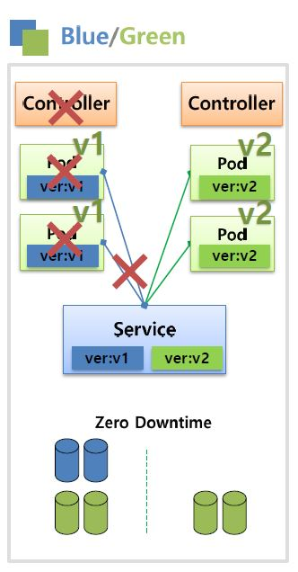
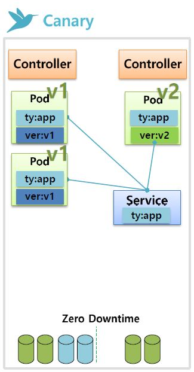

# k8s Architecture

쿠버네티스는 중앙(Master)에 API 서버와 상태 저장소를 두고, 각 서버(Node)의 에이전트(kubelet) 과 통신하는 구조.

- master: 전체 클러스터를 관리하는 서버
- node: 컨테이너가 배포되는 서버

**Master 구성 요소**

- API 서버 (kube-apiserver): 모든 요청을 처리하는 API 서버
- 분산 데이터 저장소 (etcd): key-value 저장소
- 스케쥴러, 컨트롤러 (kube-scheduler, kube-controller-manager, cloud-controller-manager)

**Node 구성 요소**

- kubelet: 노드에 할당된 파드의 생명주기 관리
- kube-proxy: 파드로 연결된 네트워크 관리
- 추상화: 컨테이너(containerd, rktm ,CRI-O) 런타임 지원

# Object

기본 오브젝트(기본적인 구성 단위)와 컨트롤러(기본 오브젝트를 생성/관리)로 이루어진다.

## 기본 오브젝트

### Pod

가장 기본적인 배포단위 (쿠버네티스는 파드 단위로 배포)

1. Container

- 파드는 하나 이상의 컨테이너를 가질 수 있으며, 여러개의 컨테이너를 파드 단위로 묶어 배포한다.
- 하나의 파드 내 컨테이너 A, B는 같은 포트를 사용할 수 없다 (충돌)
- 쿠버네티스 클러스터 내에서만 컨테이너에 접근 가능하며, 외부에서 접근이 불가하다
- IP 는 자동으로 할당되며, 재생성 시 IP는 변경된다. (휘발성)

2. Label

- 파드 생성 시 사용 목적에 따라 라벨을 등록할 수 있다. (key:value 형태)
- ex) type: web 인 라벨을 등록하여 해당 라벨이 달린 파드만 배포한다.

3. Node Schedule

- 파드를 노드에 연결하는 스케쥴링.
- 직접 노드를 선택하거나, 스케쥴러가 메모리 상황 등을 판단하여 노드에 연결시킨다.

4. and More ...

- [**Pod - 중급편**](./k8s-pod.md)

### Service

파드 배포 시, 여러 개의 파드를 하나의 서비스로 묶어 배포한다.

1. Cluster IP

- 파드의 IP가 휘발성인 반면, 서비스의 Cluster IP는 재생성 시에도 변경되지 않는다 (비휘발성)
- 쿠버네티스 클러스터 내에서만 접근 가능하며, 외부에서 접근이 불가하다
- 서비스 -> 파드로 트래픽 분산 (randomly)
- 서비스 디버깅, 내부 트래픽/대시보드, 인증된 사용자 연결 시 사용

2. NodePort

- 모든 노드에 port 할당하여, 외부에서 접근이 가능하도록 함
- 외부 요청을 받으면 Service 가 랜덤하게 노드에 트래픽을 분산 처리하나, `externalTrafficPolicy: local` 옵션을 사용할 경우 요청받은 특정 노드에 트래픽을 할당한다.
- 데모나 임시 연결용으로 사용 (PROD env X)

3. Load Balancer

- 로드밸런싱
- GCP, AWS, Azure 등의 CSP에서는 로드 밸런서 external IP 를 지원함

### Volume

파드 내의 컨테이너들끼리 데이터를 공유하기 위해 사용

파드가 기동할 때 컨테이너에 마운트하여 사용한다.

1. emptyDir

- 파드 생성 시 만들어지고, 삭제 시 함께 삭제된다.
- 일시적인 데이터만 관리하는 것을 권장

2. hostPath

- `path: /url` 옵션을 이용해 각 노드의 path 사용
- 특정 노드에 있는 데이터를 파드에서 사용하기 위함
- 파드가 죽어도 볼륨은 유지되나, 파드를 재생성 시 기존 노드에 연결이 보장되지 않음 (이 경우 기존 노드의 볼륨에 접근할 수 없기 때문에, 수동으로 마운트해 주어야 함. )

3. PVC/PV

- 컨테이너가 재시작/배포 될 때 로컬 디스크의 내용이 유실됨 -> 데이터의 영속성을 보장하기 위한 스토리지
- Persistant Volume(PV) 생성 -> Persistant Volume Claim(PVC) 생성 -> PV 연결 -> Pod 생성 시 PVC 마운팅

### ConfigMap, Secret

1. ConfigMap

- 컨테이너에서 필요한 환경 설정 내용을 컨테이너와 분리하여 제공하기 위한 기능
- dev, prod 등 서로 다른 설정을 필요로 할 경우 사용
- ConfigMap을 컨테이너와 분리함으로써, 하나의 동일한 컨테이너를 가지고 dev, staging, prod용으로 모두 사용할 수 있다

2. Secret

- 비밀번호, OAuth 토큰, ssh 키 등 민감 정보를 저장하는 용도로 사용
- key:value 형태로 구성하며, 값은 base64 로 인코딩됨

### Namespace, ResourceQuota, LimitRange

1. Namespace

- Namespace 별로 자원을 분리하여 관리 (다른 네임스페이스의 파드에 접근은 가능)
- 노드나 PV 는 값을 공유할 수 있다.
- Namespace 가 삭제되면 내부의 자원도 삭제된다

2. ResourceQuota

- Namespace 의 자원 한계를 설정하는 오브젝트

3. LimitRange

- 파드마다 Namespace 에 들어올 수 있는지 체크하며, 한도 초과 시 접근 제한
- min, max, maxLimitRequestRatio 값 설정

## Controller

- 기본 오브젝트를 생성하고 관리하는 역할
- Auto Healing, Auto Scaling, Software Update (& Rollback when error), Job

### Replication Controller, ReplicaSet

1. Replication Controller (Deprecated!)

- 지정된 숫자로 파드를 기동시키고 관리하는 역할
- 구성
  1. Replica의 수: 지정된 숫자만큼 파드의 수를 유지하도록 한다
  2. Pod Selector: 라벨을 기반으로하여 RC가 관리한 파드를 가지고 온다
  3. Pod Template: 파드에 대한 정보(도커 이미지, 포트, 라벨 등)를 정의하여, 파드를 추가 기동 시 template 을 사용

2. ReplicaSet

- RC의 새 버전. set 기반의 Pod selector 를 사용
- `matchExpressions: {key:value, operator:Exists}` 옵션을 사용하여 보다 디테일한 selector 설정이 가능

### Deployment

1. ReCreate

   

- 기존 RC의 replica 수 = 0 으로 변경 후 새로운 RC 를 생성
- Downtime, 추가 리소스 필요 X

2. Rolling Update

   

- Pod를 하나씩 업그레이드 해가는 방식
- {새로운 RC 생성 (replica 수 +1) & 기존 RC 의 replica 수 -1} 를 반복작업하여, 새로운 RC에 생성된 파드만 서비스되도록 함
- 만약에 배포가 잘못되었을 경우에는 기존 RC의 replica 수를 원래대로 올리고, 새버전의 replicat 수를 0으로 만들어서 예전 버전의 Pod로 롤백 가능
- Zero Downtime, 추가 리소스 필요

3. Blue-Green

   

- 블루(예전)버전으로 서비스 하고 있던 시스템을 그린(새로운)버전을 배포한 후, 트래픽을 블루에서 그린으로 한번에 돌리는 방식
- 배포가 완료되고 문제가 없으면 예전 버전의 RC 와 Pod를 지워준다
- Zero Downtime, 추가 리소스 필요

4. Canary

   

- 두 개의 RC를 두고, Ingress Controller 를 사용하여 url path 에 따라 서비스에 연결하도록 함
- 배포가 완료되고 문제가 없으면 새 버전의 url path 를 변경하고 예전 버전의 RC와 Pod를 지워준다
- targeting test 에 용이
- Zero Downtime, 추가 리소스 필요

### DaemonSet, Job, CronJob

1. DaemonSet

- ReplicaSet 이 자원상태를 고려하여 노드에 파드를 생성하는 반면, DaemonSet 은 자원상태에 관계 없이 모든 노드에 파드를 생성한다
- Performance, Logging, Storage에 사용

2. Job

- 하나 이상의 파드를 지정하고, 지정된 파드를 성공적으로 실행하도록 하는 설정
- Backup, Checking, Messaging, Batch process 에 사용

3. CronJob

- Scheduling 에 맞추어 주기적으로 Job을 실행
- `concurrencyPolicy:Allow / Forbid / Replace`

**Pod 를 어떻게 생성했느냐에 따라 Job/CronJob에서 파드의 실행이 달라진다.**

1. 직접 생성한 Pod: 노드1이 다운될 시, 그대로 서비스 다운 (노드2로 recreate 되지 않음)
2. Controller 로 생성한 Pod: 노드1이 다운될 시, 노드2로 recreate & restart (controller - auto healing 기능)
3. Job 으로 생성한 Pod: 노드1이 다운될 시, 노드2로 recreate & finish
