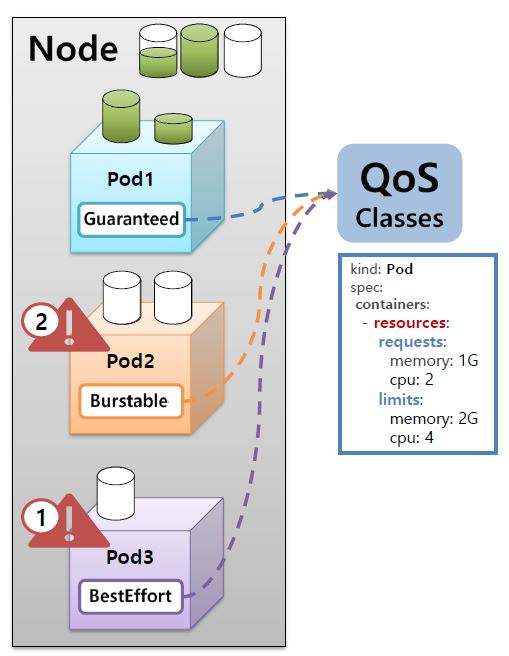

# Pod

## Lifecycle

파드는 아래의 생명주기를 가진다.

1. Pending

- 최초의 단계
- Status는 Phase, Conditions, Reason 으로 구성됨
  - Phase: Pending, Running, Succeeded, Failed, Unknown
  - Conditions: Initialized, ContainerReady, PodScheduled, Ready
  - Reason: ContainersNotReady, PodCompleted
- 컨테이너를 초기화하고, 노드 스케쥴링을 설정

2. Running

- Pending 이후 파드가 실행되는 단계

3. Succeeded

- Job/CronJob 으로 생성된 파드의 경우, 일을 마치면 더이상 돌지(Running) 않고 Succeeded / Failed 상태로 전환
- 파드의 모든 컨테이너가 성공적으로 배포 완료된 상태

4. Failed

- 장애가 발생하여 배포 실패한 상태

## Probe

컨테이너에서 kubelet에 의해 주기적으로 수행되는 진단(diagnostic). 파드의 상태를 체크하며 쿠버네티스 운영의 안정성을 더해주는 기능을 한다.

진단 결과는 Success, Failure, Unknown 으로 나뉘며, Probe의 종류는 ReadinessProbe, LivenessProbe, StartupProbe가 있다.

1. ReadinessProbe

- 하나의 노드에 장애가 발생하여 죽을 경우, 파드는 Auto healing 기능을 통해 새로운 노드에 생성&배포된다.
- 이 때, Application 이 아직 완전히 구동되지 않은 상태라면, 서비스와 연결이 되자마자 트래픽이 새로운 파드로 유입되어 사용자는 50퍼센트의 확률로 에러페이지를 보게된다.
- 이를 방지하기 위해 `ReadinessProbe` 기능을 이용하여, Application 이 완전히 구동되기 전까지는 해당 파드와의 연결을 끊어놓고(Disconnection) 애플리케이션이 Ready 되면 해당 파드에 트래픽이 분산될 수 있도록 한다.

```
apiVersion: v1
kind: Pod
metadata:
  name: pod-readiness-exec1
  labels:
    app: readiness
spec:
  containers:
  - name: readiness
    image: kubetm/app
    ports:
    - containerPort: 8080
    readinessProbe:
      exec:
        command: ["cat", "/readiness/ready.txt"]
      initialDelaySeconds: 5    # 5초 지연 후 초기화
      periodSeconds: 10         # 10초 후에 재시도
      successThreshold: 3       # 3회 성공시 Ready: true
    volumeMounts:
    - name: host-path
      mountPath: /readiness
  volumes:
  - name : host-path
    hostPath:
      path: /tmp/readiness
      type: DirectoryOrCreate
  terminationGracePeriodSeconds: 0
```

2. LivenessProbe

- Application 에 장애가 발생하는 경우는 크게 두 가지(서버 자체의 오류 / 서비스 오류)이다.
- 서비스 내에서 장애가 발생한 경우, Pod는 계속 Running 상태이기 트래픽 문제가 발생하게 된다.
- 이를 방지하기 위해 `LivenessProbe` 옵션을 사용하여, 해당앱에 문제가 생긴 후 파드를 재실행하게 만들어서 잠깐의 트래픽에러는 발생하겠지만, 지속적으로 에러가 발생하여 장애상황이 생기는것을 방지해준다.

```
apiVersion: v1
kind: Pod
metadata:
  name: pod-liveness-httpget1
  labels:
    app: liveness
spec:
  containers:
  - name: liveness
    image: kubetm/app
    ports:
    - containerPort: 8080
    livenessProbe:
      httpGet:
        path: /health
        port: 8080
      initialDelaySeconds: 5   # 5초 지연 후 초기화
      periodSeconds: 10        # 10초 후에 재시도
      failureThreshold: 3      # 3회 실패시 Restart
  terminationGracePeriodSeconds: 0
```

## Quality of Service (QoS classes)

기존 사용중인 파드에서 리소스의 추가 할당이 필요한 상황이 발생할 때, 파드 간 우선순위를 정하여 요청한 자원을 배치하거나 파드를 삭제하는 기능



1. Guaranteed

- 우선순위 1순위
- 모든 Containter 에 Request 와 Limit 을 설정
- Request 와 Limit 에는 Memory 와 CPU 를 모두 설정
- 각 Container 내 Memory와 CPU의 Request 와 Limit 값이 같음

2. Burstable

- 우선순위 2순위
- Guaranteed 와 BestEffort 의 중간 (Request 와 Limit 을 설정할수도/안할수도 있다.)
- OOM score(Out of Memory)를 계산하여 사용량이 높은 Pod가 먼저 삭제된다.  
  ex) (Pod1) App memory(4G) : Request memory(5G) VS. (Pod2) App memory(4G) : Request memory(8G)
  => Pod1 의 OOM 이 더 높으므로 Pod1이 먼저 삭제됨

3. BestEffort

- 우선순위 3순위 (가장 먼저 삭제되는 파드)
- 어떤 Container 내에도 Request 와 Limit 미설정

## Node Scheduling

생성할 파드가 어떤 노드에 할당되어야 할지, 유저가 설정한 값에 맞추어 Node Scheduler가 이를 실행한다.

노드 스케쥴링을 할 때에는, 크게 세 가지 방법이 있다.

- 노드를 선택하여 스케쥴링
- 파드 간 집중/분산하여 노드에 할당
- 노드 할당 제한

### 노드 선택: NodeName, NodeSelector, NodeAffinity

1. NodeName

- 노드명을 명시하여 pod에 배치
- 노드 이름이 바뀌는 경우가 있기 때문에 비권장

2. NodeSelector

- 노드에 label(key:value) 을 달아 해당 라벨이 달린 노드에 pod를 배치
- label 이 중복되는 노드가 있는 경우 자원 상황이 여유로운 쪽으로 붙게 됨

3. NodeAffinity

- pod에 key를 설정하여 해당 키에 해당하는 노드 중 자원이 여유로운 쪽으로 할당
- 조건에 맞는 key 를 가지고 있지 않을 경우, 노드 스케쥴러가 판단하여 자원 상황에 맞게 할당한다
- `matchExpressions`, `required/preferred`, `preferred weight` 옵션을 사용하여 디테일한 스케쥴링 설정이 가능하다

```
apiVersion: v1
kind: Pod
metadata:
 name: pod-required
spec:
 affinity:
  nodeAffinity:
   requiredDuringSchedulingIgnoredDuringExecution:
    nodeSelectorTerms:
    - matchExpressions:
      - {key: ch, operator: Exists}
 containers:
 - name: container
   image: kubetm/app
 terminationGracePeriodSeconds: 0

```

### 파드 간 집중/분산하여 노드에 할당: Pod Affinity, Anti-Affinity

1. Pod Affinity

- 서로 같은 노드에 할당되도록 스케쥴링
- master pod와 해당 파드와 함께 사용해야 하는 pod가 있는 경우 ex) Web/Server

2. Anti-Affinity

- 서로 다른 노드에 할당되도록 스케쥴링
- 노드에 두 개 pod가 같이 있으면 해당 node 다운 시 서비스가 다운될 수 있는 경우 ex) Master/Slave

```
# master
apiVersion: v1
kind: Pod
metadata:
  name: master
  labels:
     type: master
spec:
  nodeSelector:
    a-team: '1'
  containers:
  - name: container
    image: kubetm/app
  terminationGracePeriodSeconds: 0
```

```
# slave
apiVersion: v1
kind: Pod
metadata:
 name: slave
spec:
 affinity:
  podAntiAffinity:
   requiredDuringSchedulingIgnoredDuringExecution:
   - topologyKey: a-team
     labelSelector:
      matchExpressions:
      -  {key: type, operator: In, values: [master]}
 containers:
 - name: container
   image: kubetm/app
 terminationGracePeriodSeconds: 0
```

### 노드 할당 제한: Toleration, Taint


1. Toleration (Pod side) / Taint (Node side)

- Taint 가 달린 노드에는 Toleration 이 일치하는 파드만 연결될 수 있다. (O)
- Toleration 이 있는 파드는 Taint 가 달린 노드에만 연결될 수 있다. (X)
- GPU 등 특별한 하드웨어 옵션을 가진 노드들을 이용해야 하는 특정 파드를 배치할 경우 유용
- effect: `NoSchedule`, `NoExecute`
  - NoSchedule: 다른 pod들이 배치되지 않는다. 단, 기존에 이미 배치되었던 pod는 사라지지 않는다.
  - NoExecute: 일반 pod 배치 금지뿐만 아니라 기존 pod가 삭제된다. 삭제를 원하지 않는 pod가 있는 경우, 파드 생성 시 `toleration effect: noExecute` 설정 필요
