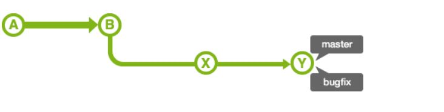
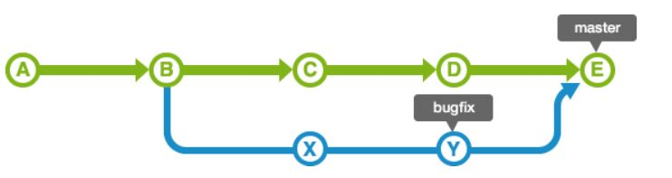
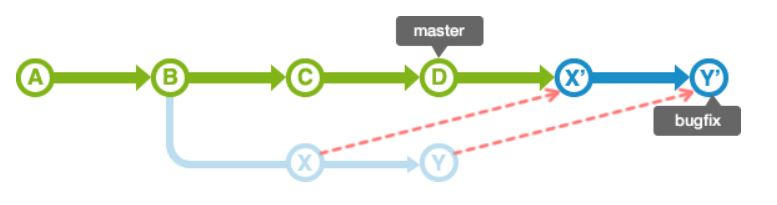

# git tutorial 
프로젝트 진행하는데 git 을 제대로 쓸 줄 모르다 보니 충돌 났을 때 벌벌 떨면서 삐질삐질 땀 흘리는 것도 지겹다.. (이젠 어느정도 할 줄 알긴 하지만 내가 아는 방법으로 해결 안되면 또다시 벌벌대기 시작함)

막상 해보면 그리 어렵지 않은데 자꾸 새로운 케이스가 등장해서 나를 떨게 만든다. 이참에 정리해보는 git 주요 사용법. 

push, pull, clone, commit 은 너무 간단하니 branch 에서부터. 

<br><br>


# branch 
- 독립적으로 작업을 진행하기 위한 개념. 각각의 브랜치는 다른 브랜치에 영향을 받지 않으며, 각각의 브랜치는 다른 브랜치와 병합할 수 있다.  
- default: master 브랜치
- HEAD: 현재 사용중인 브랜치의 선두 부분을 나타내는 이름. ~(틸드), ^(캐럿) 을 사용하여 현재 커밋으로부터 특정 커밋의 위치를 가리킬 수 있다. 
    - HEAD~~: HEAD 보다 2세대 앞의 커밋
    - HEAD^: 브랜치 병합에서 1번째 원본 
- stash: 파일의 변경 내용을 일시적으로 기록해두는 영역. 아직 커밋하지 않은 변경을 일시적으로 저장해두며, stash에 저장된 내용은 나중에 다시 불러와 브랜치에 커밋할 수 있다. 

<br><br>

## 브랜치 생성하기 
```
git branch <branchname>
```

<br>

## 브랜치 목록 확인하기 
```
git branch
```

<br>

## 브랜치 전환하기 
```
git checkout <branchname>
```

<br>

## 브랜치 삭제하기 
```
git branch -d <branchname>
```

<br>

## 깃에 커밋하기 
```
git add myfile.txt
git commit -m "add description"
```


<br><br>

# 병합하기 (1) merge:

## 1. fast-forward : 


## 2. non-fast-forward: 


<br>

## merge를 이용하여 브랜치 병합하기
```
git merge <commitname>
```
지정한 커밋 내용이 HEAD 가 가리키고 있는 브랜치에 넣어진다. master 브랜치에 issue1을 넣기 위하여는, 우선 master 브랜치가 HEAD에 위치하도록 checkout 명령어를 통해 브랜치를 전환하여야 한다. 


<br><br>

# 병합하기 (2) rebase:


<br>

## rebase 를 이용하여 브랜치 병합하기 
```
git checkout issue3
git rebase master

...

git add myfile.txt
git rebase --continue
```

issue3 브랜치로 전환하여 master 브랜치에 rebase 를 진행한다. rebase의 경우, 충돌 해결 후 commit 이 아닌 <strong>rebase --continue</strong> 옵션을 지정하여 실행하여야 한다.

<br><br>

## 커밋 취소하기
```
git reset --hard HEAD~
```
커밋을 버리고 특정 버전으로 되돌아간다. 모드: soft, mixed, hard
|모드명|HEAD의 위치|인덱스|작업트리|
|------|--- |---|---|
|soft|변경|변경X|변경X|
|mixed|변경|변경|변경X|
|hard|변경|변경|변경|
