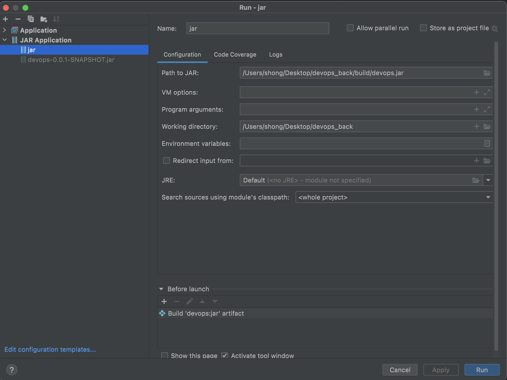

# java project 배포

(pre-requisite)

1. AWS EC2 인스턴스 생성
2. [네트워크 및 보안 - 보안그룹] 의 인바운드 규칙 추가 (HTTP, HTTPS: 0.0.0.0/0)

## 1. export jar 
java project 를 .jar 파일로 내보낸다. 이 프로젝트를 진행하면서 IntelliJ IDE 를 본격적으로 처음 사용하고 있어서, IntelliJ로 export 하는 방법을 정리하려 한다. 


### 1. create jar

1. File - Project Structure... (shortcut: command⌘ + ;)
2. Project Settings - Artifacts - Add (+) - Jar - From modules with dependencies... 
3. jar 파일로 생성할 대상 모듈 선택, 해당 모듈의 Main Class 선택, MANIFAST 디렉토리 설정 (src/main/resources)

4. Output layout(jar 파일이 출력될 경로) 확인 후 OK

### 2. build jar
1. Build - Build Artifacts - Build Action: Build 
2. 설정한 경로에 .jar 파일 생성 

### 3. run jar
1. Run - Edit configuration (shortcut: command⌘+ option⌥ + R)
2. Add(+) - Jar application - Path to JAR 및 Before launch 설정 

3. Run 


## Troubleshooting 

이렇게 해서 정상적으로 실행이 되어야 하겠지만.., 내 경우는 아래 에러가 발생했다. 

```
No auto configuration classes found in META-INF/spring.factories
```

jar 파일을 생성하면서 META-INF/METAFEST.MF 파일을 생성하는데, 오류 메세지는 spring.factories 이라는 파일을 이야기하고 있다. 

정확한 원인은 아직 찾지 못하였으나, maven build 하는 방식과 IntelliJ에서 제공하는 빌드 방식이 차이가 있어서 발생하는 오류로 추정된다. 

(spring boot 에서 메인 클래스를 찾는 auto-configuration 설정이 필요한데, intelliJ는 이를 지원하는데 jar 로 내보낸 파일을 실행할 시에는 해당 내용이 빠져있기 때문인지? 

[spring.factories 파일을 직접 생성](https://github.com/spring-projects/spring-boot/blob/main/spring-boot-project/spring-boot-autoconfigure/src/main/resources/META-INF/spring.factories)하여 다시 실행해보기도 하였는데, 역시 Configuration 오류가 발생했다. 
)

열심히 구글링하여 pom.xml 에 build 관련 maven 플러그인을 아래와 같이 추가해준다. (packaging 설정도 빠져있어서 함께 추가했다. )

```
<groupId>com.test</groupId>
<artifactId>devops</artifactId>
<version>0.0.1-SNAPSHOT</version>
<packaging>jar</packaging>
<start-class>com.test.devops.DevopsApplication</start-class>
...

...

<build>
    <plugins>
        <plugin>
            <groupId>org.springframework.boot</groupId>
            <artifactId>spring-boot-maven-plugin</artifactId>
            <configuration>
                <fork>true</fork>
                <mainClass>${start-class}</mainClass>
            </configuration>
            <executions>
                <execution>
                    <goals>
                        <goal>repackage</goal>
                    </goals>
                </execution>
            </executions>
        </plugin>
    </plugins>
</build>
```


이제 되겠지? 다시 돌려본다. 

안된다. 

좀 더 찾아보니 maven 빌드하기 전에 clean 을 먼저 해주는 방법을 추천해준다. 

Run - Edit configuration 의 before launch 옵션에 `mvn clean package spring-boot:repackage` 커맨드를 실행하도록 설정을 추가했다. 


이제 되겠지? 다시 돌려본다. 

안된다. 

좀 더 구글링해서 빌드 플러그인을 하나 더 추가해보았다. (https://stackoverflow.com/questions/38792031/springboot-making-jar-files-no-auto-configuration-classes-found-in-meta-inf)

```
 <plugin>
    <artifactId>maven-assembly-plugin</artifactId>
    <version>2.2-beta-5</version>
    <configuration>
        <archive>
            <manifest>
                <addClasspath>true</addClasspath>
                <mainClass>${start-class}</mainClass>
            </manifest>
        </archive>
        <descriptorRefs>
            <descriptorRef>jar-with-dependencies</descriptorRef>
        </descriptorRefs>
    </configuration>
    <executions>
        <execution>
            <id>assemble-all</id>
            <phase>package</phase>
            <goals>
                <goal>single</goal>
            </goals>
        </execution>
    </executions>
</plugin>
```


이제 되겠지? 다시 돌려본다. 

여전히 안된다. 

이제 조금 (많이) 승질이 난다. 

<br>

찾아보니 직접 생성한 jar 파일에서는 나와 동일한 이슈가 발생하는데, `/target/` 폴더에 생성된 *-/SNAPSHOT.jar 파일은 정상 작동을 한다는 글을 발견했다. 

이젠 정말 되겠지? 다시 돌려본다. 

된다! 

왜.. 될까. 


앞서 말한대로 intelliJ를 이용한 빌드 방식과 maven 빌드 방식이 차이가 있어서 발생하는 것 같기는 한데... 정확한 이유를 모르겠다. 

아무튼.. 겨우 성공적으로 실행할 수 있었다. 오늘 이것 때문에 도대체 몇시간을 허비한건지.. 

<br>

추후 Dockerfiles 에서도 COPY 경로를 /target/ 의 jar 파일로 설정해주어야한다. 

```
...
EXPOSE 8080
WORKDIR /data
COPY ./target/*.jar /data/devops.jar
ENTRYPOINT exec java -jar /data/devops.jar
```

