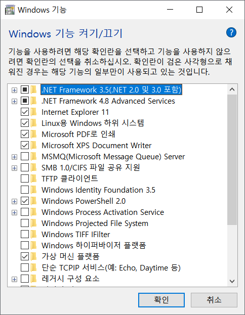

# WSL 2 설치

## 1. Microsoft Store 에서 Windows Terminal 설치

​

```
- Win+S -> store 검색
- terminal 검색
```

​

## 2. Windows Terminal 관리자 권한으로 실행

​

```
- Win+S -> terminal 검색 -> 마우스 우 클릭 -> 관리자 권한으로 실행
```

​

## 3. WSL 활성화

​

```shell
> dism.exe /online /enable-feature /featurename:Microsoft-Windows-Subsystem-Linux /all /norestart
> dism.exe /online /enable-feature /featurename:VirtualMachinePlatform /all /norestart
```

​

## 4. 윈도우 재부팅

​

## 5. Microsoft Store 에서 Ubuntu 설치

​

## 6. Linux 커널 업데이트 패키지 설치

​

- [Linux 커널 업데이트 패키지 다운로드](https://docs.microsoft.com/ko-kr/windows/wsl/install-win10#step-4---download-the-linux-kernel-update-package)

​

## 7. WSL 2를 기본 버전으로 설정

```shell
> wsl --set-default-version 2
> wsl --set-version Ubuntu 2
```

## 8. Ubuntu 터미널 실행

Windows Terminal 을 실행하고 탭 오른쪽 아래 꺽쇠 클릭
​
​

## 9. Font setup

1. Ctrl + ,
2. Ubuntu 선택
3. 모양 탭
4. 글꼴 : D2Coding
5. 저장

## 참고 자료

- [Windows 10에 Linux용 Windows 하위 시스템 설치 가이드](https://docs.microsoft.com/ko-kr/windows/wsl/install-win10)
- [Windows 터미널 설치 및 설정](https://docs.microsoft.com/ko-kr/windows/terminal/get-started)

## 트러블 슈팅

### 관련된 개체 종류에 대한 해당 작업은 지원되지 않습니다. [코드 4294967295로 프로세스 종료됨]

터미널에 아래 명령어를 통해 확인해보니 Ubuntu 가 Stopped 상태였다.

```
wsl -l -v

  NAME      STATE           VERSION
* Ubuntu    Stopped         2
```

1. 가장 흔한(?) 해결 방법은 [Windows 기능 켜기/끄기 -> Windows Subsystem for Linux, Virtual Machine feature] 항목을 재설정하는 것이다.
   (비활성화 -> 재부팅 -> 활성화 -> 재부팅 후 Ubuntu 실행)



<br>

터미널에서도 적용할 수 있다.

```
> 비활성화
DISM /online /disable-feature /featurename:VirtualMachinePlatform /norestart
DISM /online /disable-feature /featurename:Microsoft-Windows-Subsystem-Linux /norestart

> 활성화
DISM /online /enable-feature /featurename:VirtualMachinePlatform /norestart
DISM /online /enable-feature /featurename:Microsoft-Windows-Subsystem-Linux /norestart
```

<br>

보통은 재설정 후 정상적으로 Running 되는데, 나는 여전히 Stopped 상태.
Ubuntu 를 삭제하고 재설치를 했는데, 이 때엔 Running 상태로는 정상적으로 도는데도 여전히 wsl 에 접근하려 하면 아래 오류가 발생했다.

```
  NAME      STATE           VERSION
* Ubuntu    Running         2
```

2. 구글링을 해보니 우분투를 껐다가 다시 실행하면 된다.. root 로 들어가서 비밀번호를 초기화하라는 등의 해결책도 있었으나
   wsl 로 접근 자체가 안되고 있으니 나에게 해당되는 케이스가 아니었다.

3. 여러 구글링 끝에 아래 커맨드를 실행하니 드디어 wsl 로 접근할 수 있었다.
   이 커맨드는 [Winsock 카탈로그를 재설정하고 네트워크 어댑터의 소프트웨어를 기본 설정으로 재설정] 하는 기능을 한다고 하는데...
   추정으로는 일전에 k8s 교육 들을 때 네트워크 어댑터를 수정했던 기억이 있는데, 그 설정이 남아있어서 그런게 아닐까.. 싶다.

```
netsh winsock reset
```

반성 & 느낀 점:

지난주에 교육 복습하려고 vm에 설정하고 vagrant 올릴 때도 접근 오류가 났었다.

그 때도 네트워크 문제일거라 생각은 했는데 해결책을 못찾아서 이틀 내내 삽질하고 결국 다른 방법으로 넘어갔었는데, 아마 이 초기화를 해줬으면 되지 않았나.. 싶기도 하다.

예전에도 느꼈지만 인프라/네트워크 기본 지식이 부족하다 보니 이런 문제가 생길 때마다 문제 원인을 못찾아서 한참을 해맨다. '네트워크를 잘몰라서~~' 라는 식의 핑계는 이제 그만 대고 기초부터 공부를 해야겠다.
