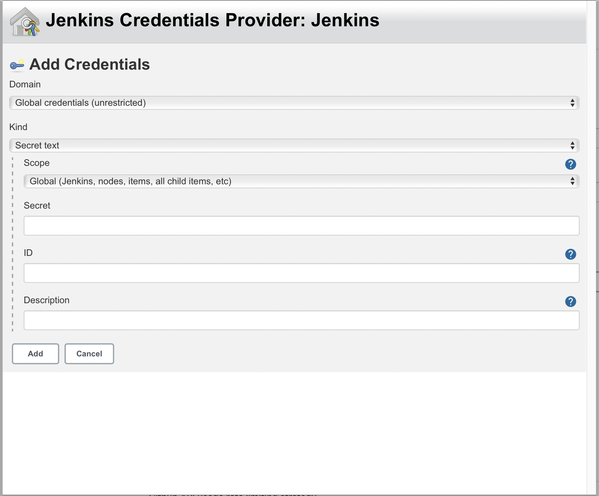

# docker를 사용하여 Jenkins 설치하기 

## 1. docker 이미지 다운로드 & 실행
```
$ docker run -itd --name jenkins -p 9000:8080 jenkins/jenkins:lts
```

## 2. Jenkins 접속
- 도커 이미지 실행 시 설정한 port 로 접속한다. (127.0.0.1:9000)

- 초기 패스워드를 젠킨스 컨테이너의 `/var/jenkins_home/secrets/initialAdminPassword` 경로에서 확인한다. 

```
docker exec jenkins cat /var/jenkins_home/secrets/initialAdminPassword
```

- Install suggested plugins 를 클릭하여 기본 플러그인을 설치한다. 


## 3. Github 과 연동하기 
- [git token 발급 & 설정]: Settings - Developer Settings - Personal Access Token - Generate new token 
- [jenkins]: Jenkins 관리 - 시스템 설정 - GitHub - GitHub Server - Add credential - Secret 에 발급받은 토큰값 저장 

- Test Connection 